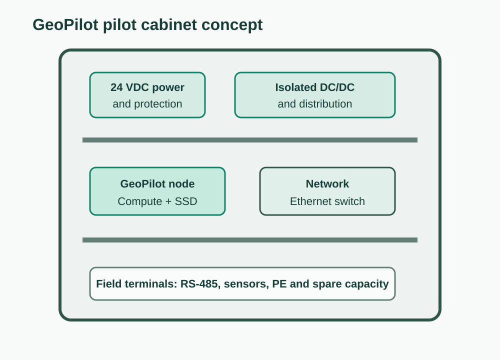

# GeoPilot Installation BOM

**Version:** 0.1.0  
**Target:** Residential pilot installation planning  
**Status:** Draft

This BOM is a planning baseline for a future permanent residential pilot. It is
not an installation drawing, wiring diagram, electrical design, or certified
bill of materials.

Final electrical design and installation must comply with applicable codes and
be reviewed by a qualified person.

## Permanent installation component classes

| GeoPilot ID | Category | Component class | Qty | Status | Purpose |
| --- | --- | --- | ---: | --- | --- |
| GP-ENC-100 | Cabinet | IP-rated enclosure appropriate to the installation | 1 | Under evaluation | Houses local pilot hardware |
| GP-MNT-100 | Mounting | DIN rail or equivalent mounting system | TBD | Approved class | Provides maintainable mounting |
| GP-PWR-100 | AC/DC supply | Industrial low-voltage DC power supply | 1 | Approved class | Provides field cabinet DC power |
| GP-PWR-101 | DC/DC conversion | Isolated DC/DC converter where needed | TBD | Under evaluation | Separates field power from compute power |
| GP-PROT-100 | Protection | Fuses, breakers, or protection devices as engineered | TBD | Design required | Protects wiring and equipment according to code |
| GP-TERM-100 | Terminals | DIN-rail terminal blocks | TBD | Approved class | Terminates field wiring cleanly |
| GP-TERM-101 | Grounding | Protective-earth terminals and ground bar | TBD | Design required | Supports grounding and bonding requirements |
| GP-CAB-100 | Cable entry | IP-rated cable glands | TBD | Approved class | Protects cable entry points |
| GP-CAB-101 | Internal wiring | Code-appropriate stranded control wire | TBD | Approved class | Cabinet internal wiring |
| GP-CAB-102 | Identification | Wire and terminal labels | TBD | Approved class | Maintenance and troubleshooting |
| GP-NET-100 | Network | DIN-rail or wall-mounted Ethernet switch | 1 | Under evaluation | Local network inside or near the cabinet |
| GP-MNT-101 | Compute mount | Mounting plate for selected compute node | 1 | Under evaluation | Secures local compute hardware |

## Cabinet partitioning

Maintain physical separation between:

- mains-voltage circuits;
- low-voltage DC field power;
- communication wiring;
- low-voltage computing;
- sensor electronics;
- protective-earth conductors.

## Installation constraints

- The MVP remains read-only.
- No active equipment command path is included.
- GeoPilot must not bypass or replace manufacturer protections.
- Field interfaces should be isolated where required by the circuit.
- Permanent installation work must be reviewed by a qualified person.
- Exact components remain under evaluation until installation requirements are
  confirmed.

## Deferred installation decisions

- Final cabinet size and IP rating.
- Final power architecture.
- Protection device selection.
- Grounding and bonding strategy.
- Cable routing and separation distances.
- Environmental requirements.
- Electrical certification path.
- Production enclosure design.
